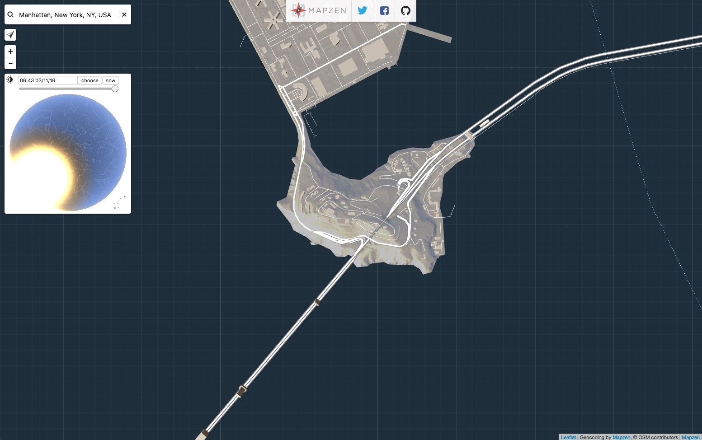

# Ux Daylight for [Tangram](https://mapzen.com/products/tangram/)


[TangramJS](https://mapzen.com/products/tangram/) is an incredible 2D/3D Map engine that contain a felixble [lighting](https://mapzen.com/documentation/tangram/Lights-Overview/) and [material](https://mapzen.com/documentation/tangram/Materials-Overview/) system. This little addon automatically set the default lights to the actual position of the sun on a give place. At the same time allows you to add the current atmosphere scattering sphere as a [spheremap](https://mapzen.com/documentation/tangram/Materials-Overview/#mapping-spheremap) to the styles.



## how it works?

First you need to add the `ux_daylight.js` and `ux_daylight.css` to your HTML document

```html
<!-- DayLight Tangram -->
<link href="https://tangrams.github.io/ux_daylight/ux_daylight.css" rel="stylesheet"/>
<script src="https://tangrams.github.io/ux_daylight/ux_daylight.js" type="text/javascript"></script>
```

Then when you finish adding Tangram as a Leaflet layer you add `uxDaylight` as a Leaflet Control.

```JS
window.addEventListener('load', function () {
    // Adding Tangram Layer to map
    layer.addTo(map);

    // Adding DayLight Control
    map.addControl(L.uxDaylight({ scene: scene }));
});
```

Is important that you **DO NOT** define any Light source on your Tangram scene YAML file. Why? Well `ux_daylight` will make use of the default `default_light` on Tangram, which is created when **NO** light is define.

Optionally, you can add a nice ambient efect to your maps by `mix`ing the `ux_daylight` style into your styles that will apply the atmosphere light as a [spheremap](https://mapzen.com/documentation/tangram/Materials-Overview/#mapping-spheremap) to your geometries.

First you need to import the `ux_daylight.yaml` to your scene file like this:

```yaml
import:
    - https://tangrams.github.io/ux_daylight/ux_daylight.yaml
```

Then you can apply it to anything that had normals, like our nice Terrain Normal Raster tiles

```yaml
sources:
    osm: 
        type: TopoJSON
        url: https://tile.mapzen.com/mapzen/vector/v1/all/{z}/{x}/{y}.topojson?api_key=mapzen-QF1osLn
        max_zoom: 16
    normals:
        type: Raster
        url: https://terrain-preview.mapzen.com/normal/{z}/{x}/{y}.png
        max_zoom: 15

styles:
    earth:
        base: polygons
        raster: normal
        mix: [ux_daylight]
```


Enjoy!